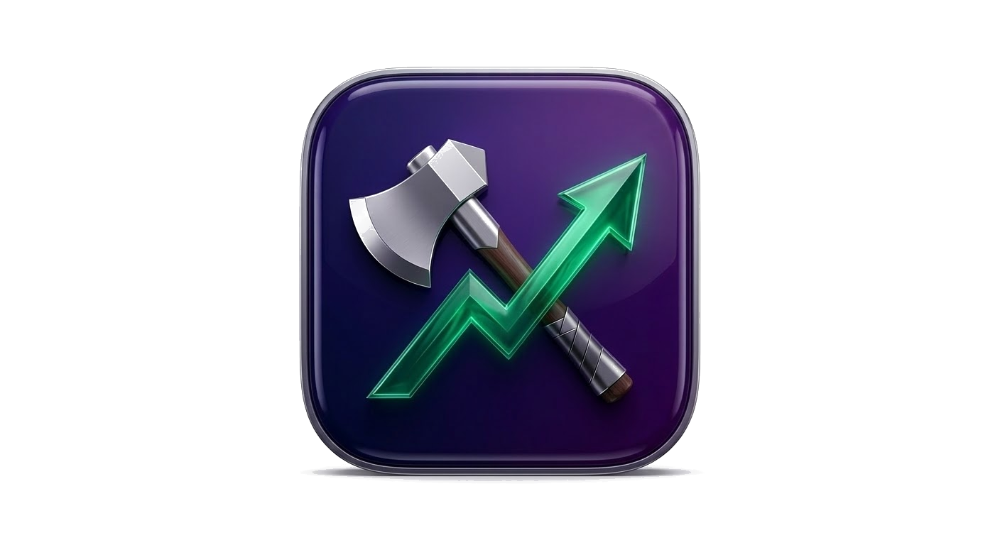

---
hide:
  - navigation
  - toc
---

<div class="ft-hero" markdown>



# fin-toolkit

<div class="ft-ticker">
MCP_SERVER &bull; PROTOCOL_FIRST &bull; 20_TOOLS &bull; 6_AGENTS &bull; 7_PROVIDERS
</div>

<div class="ft-tagline">
Financial analysis toolkit that plugs into Claude Code via MCP.
No API keys required — works out of the box.
</div>

<div class="ft-hero-actions">
<a href="getting-started/" class="ft-btn-primary">Get Started</a>
<a href="tools/" class="ft-btn-secondary">MCP Tools</a>
<a href="https://github.com/alexey1312/fin-toolkit" class="ft-btn-secondary">GitHub</a>
</div>

</div>

<div class="ft-tape">
<span class="ft-tape-item"><span class="ft-tape-label">Yahoo</span> <span class="ft-tape-up">FREE</span></span>
<span class="ft-tape-item"><span class="ft-tape-label">MOEX</span> <span class="ft-tape-up">FREE</span></span>
<span class="ft-tape-item"><span class="ft-tape-label">KASE</span> <span class="ft-tape-up">FREE</span></span>
<span class="ft-tape-item"><span class="ft-tape-label">SmartLab</span> <span class="ft-tape-up">FREE</span></span>
<span class="ft-tape-item"><span class="ft-tape-label">EDGAR</span> <span class="ft-tape-up">FREE</span></span>
<span class="ft-tape-item"><span class="ft-tape-label">DuckDuckGo</span> <span class="ft-tape-up">FREE</span></span>
<span class="ft-tape-item"><span class="ft-tape-label">Perplexity</span> <span class="ft-tape-neutral">KEY</span></span>
<span class="ft-tape-item"><span class="ft-tape-label">Tavily</span> <span class="ft-tape-neutral">KEY</span></span>
<span class="ft-tape-item"><span class="ft-tape-label">Brave</span> <span class="ft-tape-neutral">KEY</span></span>
</div>

<div class="ft-section-title">Dashboard</div>

<div class="ft-grid" markdown>

<div class="ft-card" markdown>
<div class="ft-card-header">
<span class="ft-card-title">MCP Tools</span>
<span class="ft-card-badge ft-badge-green">LIVE</span>
</div>
<div class="ft-card-value">20</div>
<div class="ft-card-desc">
Stock data, technical/fundamental/risk analysis, screening, portfolio tracking, watchlists, alerts, investment ideas, and more.
</div>
</div>

<div class="ft-card" markdown>
<div class="ft-card-header">
<span class="ft-card-title">Analysis Agents</span>
<span class="ft-card-badge ft-badge-blue">6 ACTIVE</span>
</div>
<div class="ft-card-value">6</div>
<div class="ft-card-desc">
Elvis Marlamov, Warren Buffett, Ben Graham, Charlie Munger, Cathie Wood, Peter Lynch — each with unique scoring methodology.
</div>
</div>

<div class="ft-card" markdown>
<div class="ft-card-header">
<span class="ft-card-title">Data Providers</span>
<span class="ft-card-badge ft-badge-green">8 SOURCES</span>
</div>
<div class="ft-card-value">8</div>
<div class="ft-card-desc">
Yahoo Finance, MOEX, KASE, StockAnalysis, SmartLab, Financial Datasets, SEC EDGAR, PDF Reports — automatic fallback routing.
</div>
</div>

<div class="ft-card" markdown>
<div class="ft-card-header">
<span class="ft-card-title">Search Engines</span>
<span class="ft-card-badge ft-badge-amber">8 CHAINS</span>
</div>
<div class="ft-card-value">8</div>
<div class="ft-card-desc">
DuckDuckGo, SearXNG, Google (Gemini), Perplexity, Tavily, Brave, Serper, Exa — fallback chain, first available wins.
</div>
</div>

</div>

<div class="ft-section-title">Quick Install</div>

<div class="ft-install" markdown>
<div class="ft-install-title">2 commands to start</div>

```bash
uv tool install "fin-toolkit @ git+https://github.com/alexey1312/fin-toolkit.git"
fin-toolkit quickstart
```

</div>

<div class="ft-section-title">Tools at a Glance</div>

<table class="ft-tools-table">
<thead>
<tr>
<th>Tool</th>
<th>Description</th>
</tr>
</thead>
<tbody>
<tr><td><code>get_stock_data</code></td><td>Fetch historical OHLCV price data</td></tr>
<tr><td><code>run_technical_analysis</code></td><td>RSI, EMA, Bollinger Bands, MACD, signals</td></tr>
<tr><td><code>run_fundamental_analysis</code></td><td>ROE, ROA, P/E, P/B, EV/EBITDA, margins</td></tr>
<tr><td><code>run_risk_analysis</code></td><td>Volatility, VaR, correlation matrix</td></tr>
<tr><td><code>search_news</code></td><td>Financial news search via fallback chain</td></tr>
<tr><td><code>run_agent</code></td><td>Run a single AI analysis agent</td></tr>
<tr><td><code>run_all_agents</code></td><td>Consensus from all active agents</td></tr>
<tr><td><code>run_recommendation</code></td><td>Buy/hold recommendation with position sizing</td></tr>
<tr><td><code>run_portfolio_analysis</code></td><td>Correlation-adjusted portfolio analysis</td></tr>
<tr><td><code>screen_stocks</code></td><td>Screen by valuation + custom filters</td></tr>
<tr><td><code>generate_investment_idea</code></td><td>Comprehensive idea with Plotly charts</td></tr>
<tr><td><code>parse_report</code></td><td>Extract data from PDF reports (EN/RU)</td></tr>
<tr><td><code>deep_dive</code></td><td>Batch deep dive on multiple tickers</td></tr>
<tr><td><code>compare_stocks</code></td><td>Side-by-side metric comparison</td></tr>
<tr><td><code>manage_watchlist</code></td><td>Persistent YAML-backed watchlists</td></tr>
<tr><td><code>set_alert</code></td><td>Set metric-based alerts</td></tr>
<tr><td><code>check_watchlist</code></td><td>Evaluate triggered alerts</td></tr>
<tr><td><code>manage_portfolio</code></td><td>SQLite-backed buy/sell tracking</td></tr>
<tr><td><code>portfolio_performance</code></td><td>Portfolio P&L and per-ticker returns</td></tr>
</tbody>
</table>

<div class="ft-section-title">Providers Status</div>

**Data** — automatic fallback routing by market:

<div class="ft-status-grid">
<div class="ft-status-item"><span class="ft-status-dot ft-dot-green"></span> Yahoo Finance — Global, free</div>
<div class="ft-status-item"><span class="ft-status-dot ft-dot-green"></span> MOEX — Russia, free</div>
<div class="ft-status-item"><span class="ft-status-dot ft-dot-green"></span> KASE — Kazakhstan, free</div>
<div class="ft-status-item"><span class="ft-status-dot ft-dot-green"></span> SmartLab — Russia, free</div>
<div class="ft-status-item"><span class="ft-status-dot ft-dot-green"></span> SEC EDGAR — US, free</div>
<div class="ft-status-item"><span class="ft-status-dot ft-dot-amber"></span> Financial Datasets — US, API key</div>
<div class="ft-status-item"><span class="ft-status-dot ft-dot-green"></span> PDF Reports — Any, free</div>
</div>

**Search** — fallback chain, first available wins:

<div class="ft-status-grid">
<div class="ft-status-item"><span class="ft-status-dot ft-dot-green"></span> DuckDuckGo — free</div>
<div class="ft-status-item"><span class="ft-status-dot ft-dot-green"></span> SearXNG — self-hosted</div>
<div class="ft-status-item"><span class="ft-status-dot ft-dot-amber"></span> Google (Gemini)</div>
<div class="ft-status-item"><span class="ft-status-dot ft-dot-amber"></span> Perplexity</div>
<div class="ft-status-item"><span class="ft-status-dot ft-dot-amber"></span> Tavily</div>
<div class="ft-status-item"><span class="ft-status-dot ft-dot-amber"></span> Brave</div>
<div class="ft-status-item"><span class="ft-status-dot ft-dot-amber"></span> Serper</div>
<div class="ft-status-item"><span class="ft-status-dot ft-dot-amber"></span> Exa</div>
</div>
